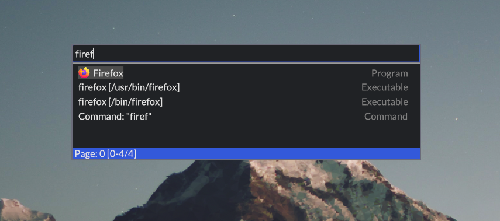

# Lanch

lanch is an application launcher written in rust using the iced ui toolkit.

### Goals
    - Usability first
    - Reasonable performance
    - Simple, modern look by default
    - Modular: it's easy to write your own modules for the search "API" 
      (implementing a rust trait really)
    - Themeable

### lanch is not a dmenu replacement
lanch does not try to be a versatile tool that you can pipe stuff into like dmenu. 

lanch is **primarly an application launcher** and internal design decisions reflect that. 
It is not a window switcher or a clock with app launching capabilities. It's the other way around :)

### Installation
standard rust package installation should do.
use `cargo install --path .` while in the lanch directory.

##### Notes on older setups
iced needs support for the Vulkan rendering API by default. If you get an error like `GraphicsAdapterNotFound`,
then try installing the Vulkan backend for your graphics driver. If that is not an option, you might alternatively try
recompiling using the OpenGL backend [(see this iced issue)](https://github.com/iced-rs/iced/issues/534). 

### Contributing
I will be happy to accept contributions that align with the project goals.
Please open an issue first if the changes are big enough.
